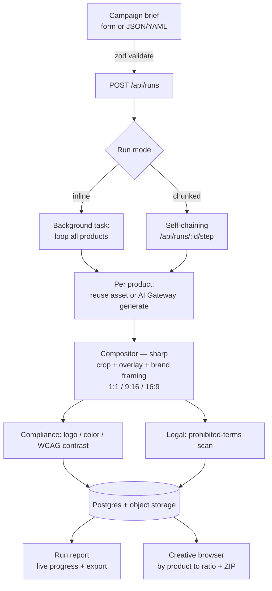

# Brand Helper — Creative Automation Pipeline

[](https://github.com/The-Tech-Margin/brand-helper/actions/workflows/ci.yml)
[](LICENSE)
[](.nvmrc)
[](CONTRIBUTING.md)
[](CODE_OF_CONDUCT.md)
[](ACCESSIBILITY.md)

Turn a campaign brief into on-brand, ready-to-post social ad creatives at scale. Brand Helper
reuses uploaded hero imagery where it exists, generates the rest with **your selected image model**
(via the Vercel AI Gateway), composites
final creatives in **three aspect ratios** with a localized message overlay and brand framing, runs
**brand-compliance** and **legal-content** checks, and persists everything to **your Postgres-compatible
backend** (row-level security + object storage) — all behind a private, themeable UI.

> Author: **@thetechmargin** · © 2026 TheTechMargin

---

## Why it exists (business value)

Brand Helper is an **open-source design toolkit for solo founders and small businesses** — the goal
is agency-quality, on-brand social creative without the agency, the per-seat SaaS, or a designer on
call. Bring a one-line brief; get back ready-to-post creatives in three aspect ratios, on your own
colors and logo, with brand-compliance and legal checks already done. Self-host it, theme it, and run
your whole pipeline on your own Postgres backend + Vercel for the cost of the image-model calls.
(Supabase is one easy option; any Postgres + RLS + object storage works.)

The same engine scales up: a **global consumer-goods team** launching hundreds of localized campaigns
a month — drowning in manual production, inconsistent brand quality, and slow approvals — gets the
same **velocity + brand consistency + localization + measurable ROI**:

- **Reuse-or-generate** per product, logged explicitly, so you never re-shoot what you already have.
- **Deterministic compositor** (sharp) renders every ratio identically from one hero master — cheap
  and reproducible.
- **Automated compliance + legal checks** catch off-brand color, low-contrast text, missing logos,
  and risky claims ("clinically proven", "guaranteed") before anything ships.
- A **run report** that reads like a marketing-ops artifact: creatives generated vs reused, locales,
  compliance pass rate, flags, time elapsed — with one-click JSON/Markdown export and a ZIP of all
  creatives organized by product and ratio.

---

## Architecture



The proxy refreshes the session and rate-limits login; the `(app)` server layout enforces
`getUser()` and RLS isolates every row per user.

**Module boundaries** (`src/`): business features live under `src/features/<domain>/` (UI +
domain logic together) — `brief/` (zod schema + JSON/YAML parse), `dashboard/`, `creatives/`,
`auth/` (passwordless login + rate-limit), `members/` (invite + activation + role assignment),
`theme/` + `brand-identity/` (the design studio: theme + per-user brand, each with an admin-set
global default), `editor/` (Konva in-app brand editor),
`deliverables/` (branded PDF + social-asset builders),
`runs/` (report formatting + read layer), and `pipeline/` (orchestrator + chunked runner +
persistence, with its `compositor/` (sharp), `compliance/`, `legal/`, `translate/`, `sound/` (stub)
processing modules). External integrations live in `src/services/` (`supabase/`, `image/` — Vercel
AI Gateway generate + edit); shared presentational UI in `src/components/{ui,layout,theme}`;
cross-cutting helpers in `src/lib/` (`logging/`, format/slug/utils); generated DB types in
`src/types/`; env + config in `src/config/`. The web UI and the CLI share the same
`src/features/pipeline` core.

---

## Access & sign-in

Brand Helper is **invite-only and passwordless** — there is no public sign-up and no anonymous/guest
browsing of the workspace.

**Requesting access.** There is no self-service request form: **ask an admin to invite your email**.
Admins invite people by email from the in-app **Members** area; you receive a sign-in link by email.
If you sign in without an invite you land on a friendly **"Invite only"** page and nothing else.

**Signing in (magic link).** Go to `/login`, enter your email, and choose **Email me a sign-in link**.
Open the email and click the link — it lands on `/auth/callback`, activates your membership, and drops
you on the **Dashboard**. Links are single-use and expire; if one fails, just request another. (The
prompt is deliberately generic and never reveals whether an email is on the invite list.)

**Roles.**

- **Admin** — invite and manage members, and publish an app-wide default theme + brand. Admins are
  defined in the database (`brand_helper.admin_allowlist`); a trigger stamps the role, so app code can
  never grant admin by mistake.
- **Visitor** — a normal invited member: runs the full pipeline (create campaigns, generate/edit
  creatives, export) on their **own** data, isolated per user by row-level security. This is the
  self-serve "just let me make creatives" experience.

**First admin (bootstrap).** Add your email to `brand_helper.admin_allowlist` (migration `0006` or a
SQL insert), create an auth user in your auth provider (public sign-ups are off), then sign in
by magic link — the allowlist promotes you to admin on first sign-in.

**Local dev shortcut.** In a dev build only, `/login` shows a **Dev sign-in (local only)** link
(`GET /auth/dev-login`, target set with `DEV_LOGIN_EMAIL`) that mints a session without the email
round-trip. It is hard-blocked in production (NODE_ENV guard + the proxy).

## Using the app & getting help

After signing in, the **Dashboard** lists your campaigns, **New campaign** (`/campaigns/new`) starts a
brief, and **Reports** collects run reports and exports. Theme, brand, and the design studio live
under **Design** (`/theme`).

**Help is always one tap (or one keystroke) away:**

- A **floating help button** — the **?** in the bottom-right corner — opens a **command palette**:
  type to search help and jump anywhere (New campaign, Reports, Design, Help…). Open it from the
  button or with **⌘K / Ctrl+K**; arrow keys move, **Enter** navigates, **Esc** closes. It is fully
  keyboard- and screen-reader-accessible and only ever shows what your role can reach.
- The same **Help** entry also lives in the hamburger menu (top-right) — both routes lead to the same
  guide.
- Both open the **Help guide** (`/help`): how the pipeline works, an anatomy-of-a-brief reference, a
  **Try it** tutorial that prefills the campaign form with a sample brief, and an FAQ.

---

## Run locally

```bash
nvm use                 # Node 20 (see .nvmrc) — the toolchain needs >=20.19
npm install
cp .env.example .env.local   # then fill in (or: vercel env pull --environment=production .env.local)
```

Apply the database schema to your Postgres backend (any SQL client or your provider's CLI), in order:

```
supabase/migrations/0001_init.sql   # tables, RLS, private storage bucket
supabase/migrations/0002_run_state_and_rate_limit.sql
supabase/migrations/0003_members_invites.sql   # invite-only membership + RLS
supabase/migrations/0004_expose_brand_helper.sql   # expose schema to the PostgREST API
supabase/migrations/0005_strict_anon_grants.sql   # least-privilege anon hardening
supabase/migrations/0006_admin_at_db_layer.sql   # admin allowlist + role trigger
supabase/migrations/0007_themes.sql   # user themes + admin-set global default theme
supabase/migrations/0008_brand.sql   # per-user brand identity + admin-set global default
```

Migration `0004` auto-exposes the `brand_helper` schema to the REST API. If you skipped it (or created
the tables by hand), expose the schema to your REST API (e.g. PostgREST's exposed-schemas config) per
your provider. Then:

```bash
npm run seed       # upload placeholder input assets so reuse-vs-generate is demoable
npm run dev        # http://localhost:3000
```

Sign up on `/login`, then create a campaign on `/campaigns/new`. **Local testing:** in a dev build,
`/login` shows a **Dev sign-in (local only)** link (route `GET /auth/dev-login`) that mints a session
for the seeded owner without the magic-link email — handy for the preview. It's hard-blocked in
production (NODE_ENV guard + the proxy) and never exists in a production build.

### Environment variables

| Variable                        | Scope       | Required | Purpose                                                                  |
| ------------------------------- | ----------- | -------- | ------------------------------------------------------------------------ |
| `NEXT_PUBLIC_SUPABASE_URL`      | browser     | yes      | Backend REST/API base URL                                                |
| `NEXT_PUBLIC_SUPABASE_ANON_KEY` | browser     | yes      | Public client key (RLS-scoped)                                           |
| `SUPABASE_SERVICE_ROLE_KEY`     | server-only | yes      | Service/admin credentials — pipeline writes + signed URLs (bypasses RLS) |
| `SUPABASE_DB_SCHEMA`            | server-only | no       | Defaults to `brand_helper`                                               |
| `SUPABASE_STORAGE_BUCKET`       | server-only | no       | Defaults to `brand-helper`                                               |
| `AI_GATEWAY_API_KEY`            | server-only | gen path | Vercel AI Gateway key — image generation + AI edits                      |
| `SOUND_ENABLED`                 | server-only | no       | Feature flag for the sound stub (keep `false`)                           |
| `NEXT_PUBLIC_APP_NAME`          | browser     | no       | UI label                                                                 |
| `NEXT_PUBLIC_SITE_URL`          | browser     | prod     | Stable base URL for auth email redirects (your domain)                   |
| `NEXT_PUBLIC_APP_ORIGINS`       | browser     | no       | Extra allowed auth-callback origins, comma-separated                     |
| `PIPELINE_RUN_USER_ID`          | server-only | CLI      | Seeded auth user UUID the CLI runs own (RLS owner)                       |
| `DEV_LOGIN_EMAIL`               | server-only | dev      | Email for `GET /auth/dev-login` (local builds only)                      |

**Access is invite-only (magic link).** Sign-in is passwordless — `/login` emails a
one-time link. Disable public sign-ups in your auth provider (email provider settings)
so the only way in is an invite. Admins are defined in the database — add an
email to `brand_helper.admin_allowlist` and a trigger stamps `members.role` from it
(migration `0006`); admins invite visitors by email from the dashboard (each invited
visitor can run the full pipeline on their own RLS-scoped records). The first admin's
auth user is created directly in your auth provider (sign-ups are off), then they sign in
via magic link.

**Auth email redirects.** Sign-in links are built from
[`src/lib/get-url.ts`](src/lib/get-url.ts), which is fully env-driven — **no host is hardcoded** —
resolving `NEXT_PUBLIC_SITE_URL` (prod) → `NEXT_PUBLIC_VERCEL_URL` (Vercel auto, previews) →
`http://localhost:3000` (local). Set `NEXT_PUBLIC_SITE_URL` to your own stable domain and add its
`…/auth/callback` to your auth provider's redirect-URL allowlist, or links are
rejected. Any extra origins the app also answers to (a vanity domain, a stable `*.vercel.app` alias)
go in `NEXT_PUBLIC_APP_ORIGINS` (comma-separated) so callbacks from them validate too.

Env getters in `src/config/env.ts` are lazy, so a missing `AI_GATEWAY_API_KEY` only errors when a run
actually generates (or an AI edit runs) — the app, build, and reuse path all work without it.

**Image generation (Vercel AI Gateway).** The "generate" path and the editor's AI ops route through
the [Vercel AI Gateway](https://vercel.com/docs/ai-gateway) with a single `AI_GATEWAY_API_KEY`. The
campaign brief's **Image model** dropdown picks the provider per campaign — OpenAI (`gpt-image-1`),
Replicate/FLUX (`bfl/flux-2-pro`), or Google (Imagen) — mapped in
[`src/services/image/model-map.ts`](src/services/image/model-map.ts). The compositor still overlays
text/logo, so the model only produces a clean hero with negative space.

**In-app editor.** Each creative has an **Edit in editor** action (and a **New design** entry on the
creatives page) that opens a Konva canvas ([`src/features/editor`](src/features/editor/brand-editor.tsx)):
add on-brand text + the logo, move/resize/rotate, run AI ops (remove background, generative replace —
gateway-routed), and save the result back as a new `edited` creative variant. No external SDK or
sign-in; AI ops degrade gracefully when `AI_GATEWAY_API_KEY` is unset.

**Branded deliverables.** The creatives page and ZIP export produce branded documents via
[`src/features/deliverables`](src/features/deliverables/index.ts) (`@react-pdf/renderer` + sharp): a
campaign PDF, a brand style sheet, per-creative spec sheets, and platform-sized social assets.

---

## Deploy to Vercel

The project is linked (`.vercel/project.json`). Set the same variables from the table above in
**Vercel → Settings → Environment Variables** (your hosting provider's database integration, if any,
can populate the backend set automatically; add `AI_GATEWAY_API_KEY`). `next build` needs no live
secrets. Then push — CI runs on every PR and Vercel builds from `main`.

---

## Make it your own (fork it)

Brand Helper is MIT-licensed — clone it, rebrand it, and run it on your own stack. The brand is
**data, not code**: most rebranding is done in the in-app **Design** studio (your colors, fonts, logo,
and an admin-set global default) with no code edits, and **no brand hostname is baked into the
source** — auth URLs come entirely from env (see [`src/lib/get-url.ts`](src/lib/get-url.ts)). To stand
up your own instance:

1. **Point it at your own Postgres-compatible backend (with RLS + object storage).** Stand up a
   backend, run the migrations in `supabase/migrations/` in order, and disable public sign-ups in your
   auth provider. Set the backend env vars and **rotate any keys** that were ever shared. _(Migration
   `0004` adds `brand_helper` to the REST API's exposed-schema allowlist; on a dedicated backend it
   simply exposes your one schema.)_
2. **Seed your first admin.** Replace the seeded owner email in
   `supabase/migrations/0006_admin_at_db_layer.sql` (and `DEV_LOGIN_EMAIL`) with your own, or insert
   your email into `brand_helper.admin_allowlist`.
3. **Set the app identity.** `NEXT_PUBLIC_APP_NAME`, `NEXT_PUBLIC_SITE_URL` (your domain), and
   `NEXT_PUBLIC_APP_ORIGINS` for any extra origins. Swap the default logo at `public/images/logo.png`,
   and tune the brand palette in `src/app/globals.css` (or just use the in-app Design studio).
4. **Deploy to your Vercel.** Import the repo, add the env vars above, and create an
   [AI Gateway key](https://vercel.com/docs/ai-gateway) for `AI_GATEWAY_API_KEY`. Push — Vercel builds
   from `main` and CI runs on every PR.
5. **Repoint docs.** Update the GitHub org/repo in the README badges and issue templates, the
   maintainer email in `SECURITY.md` / `CODE_OF_CONDUCT.md`, and the `LICENSE` copyright holder.

---

## CLI (headless runs)

```bash
npm run pipeline:run -- examples/brief.summer-glow.json
```

Validates the brief, runs the full pipeline against the database + the AI Gateway, and writes
`reports/<campaignId>.json` and `.md`. Requires `PIPELINE_RUN_USER_ID`. Chunking only matters for
serverless time limits, so the CLI runs in-process (equivalent to inline) and prints the mode the
web app would auto-select.

Other scripts: `npm run lint` · `typecheck` · `test` · `build` · `format` · `seed` · `db:types`
(regenerate `src/types/database.ts` from the live schema — set `SUPABASE_PROJECT_ID`
first: `SUPABASE_PROJECT_ID=xxxx npm run db:types`) · `docs:gen` (regenerate the
[design-system.md](design-system.md) token tables from `src/app/globals.css`; CI runs `docs:check`) ·
`sbom`.

**Stuck?** See the dev triage runbook — [runbook.html](runbook.html) (open in a browser): local
setup, a symptom → cause → fix table, CI gates, and the going-public checklist.

---

## Example input → output

`examples/` ships four briefs (`brief.summer-glow.json`, `brief.summer-glow.yaml`,
`brief.morning-fuel.json`, `brief.morning-fuel.yaml`). Each defines two or more products — one with
an `input_assets` filename
(reused) and one without (generated) — a region, audience, message, locale, and optional brand
palette.

A run produces, per product, creatives at **1:1 (1080×1080)**, **9:16 (1080×1920)** and **16:9
(1920×1080)**, each with the campaign message overlaid (English, plus a localized translation when a
`locale` is set), a contrast scrim, and brand framing. Browse them by product → ratio, edit any of
them in the in-app editor, or download a ZIP mirroring
`creatives/{product_slug}/{ratio}/{variant}.png` plus a `deliverables/` folder of branded PDFs
(campaign, brand sheet, per-creative spec sheets) and social assets.

Brand-compliance pass rates, legal flags, run reports (with JSON/Markdown export), and data
management (delete a run or a whole campaign) live in the in-app **Reports** area; each run's full
compliance, legal, and log detail is on its run report page.

---

## Design decisions & deviations

- **Storage is object-storage-only** (the brief's "save to a local folder organized by product and
  aspect ratio" is satisfied via the storage path convention `creatives/{campaign}/{product}/{ratio}/…`
  **plus** the ZIP export that reproduces that folder layout). No local disk is the source of truth.
- **Auth: full provider-backed auth, not the spec's shared password gate.** Per-user identity + RLS is
  strictly more robust than one shared password. Sign-in runs through a **server action** so every
  attempt is **rate-limited** (DB-backed, hashed IP key — in-memory limiters don't survive serverless
  cold starts). The limiter lives in `src/features/auth/rate-limit.ts`, invoked at the single auth entry point.
- **No shadcn/ui.** The repo uses a token-driven, WCAG-AA component layer (`src/components/ui/`) built on
  the existing CSS-variable theme system, documented in [design-system.md](design-system.md). This
  avoids re-theming shadcn's token model onto a hex-based system and shipping duplicate primitives.
- **One launcher, studio-consistent.** A floating **command palette** (⌘K / Ctrl+K) doubles as the
  help button and the quick-jump nav. It reuses the hamburger's role-gated routes from a single source
  ([`command-palette.commands.ts`](src/components/layout/command-palette.commands.ts)) so the two
  navigation surfaces never drift, and matches the "do anything" launcher pattern across the
  TheTechMargin studio apps.
- **Dual run execution.** `inline` finishes a small run in one background task; `chunked` self-chains
  one product per serverless invocation to dodge function timeouts on large briefs. The mode is
  auto-selected by estimated work and overridable in the UI and CLI.
- **Image generation via the AI Gateway.** A single Vercel AI Gateway key fronts OpenAI / FLUX /
  Imagen, chosen per campaign in the brief. The pipeline generates one high-res master per product and
  composites every ratio locally (cheaper + reproducible than N generations). Failures retry with
  backoff and never abort the whole campaign. The same gateway powers the editor's AI edit ops.
- **Editor is custom, not a third-party SDK.** The in-app editor is built on Konva (MIT) so brand
  prefill (palette, logo, Poppins) and AI ops are fully under our control with no per-seat licensing
  or external sign-in. PDFs use `@react-pdf/renderer` (no headless browser) so they render inside the
  Node serverless runtime.
- **Sound is a stub** (`SOUND_ENABLED=false`) — a typed interface with a no-op implementation, ready
  for a real audio provider, not active scope.
- **Translation** uses a seeded dictionary with graceful fallback to English; the `Translator`
  interface is swappable for a cloud/LLM provider.

---

## Assumptions & limitations

- **Access is invite-only** (passwordless magic link); there is no public sign-up, and the first
  admin is seeded in the database (`admin_allowlist`).
- **Storage is object-storage-only.** The brief's "save outputs to a folder organized by product and
  aspect ratio" is met by the storage path convention plus the ZIP export — a local CLI run writes the
  run report to `reports/`, not the images to disk.
- **Image generation needs `AI_GATEWAY_API_KEY`.** The reuse path, build, and tests run without it;
  only the generate path calls the gateway. Per-product failures are recorded and skipped, never
  aborting the whole run.
- **Compliance checks are heuristic** (logo presence, brand-color proximity, WCAG contrast) — a
  guardrail, not a substitute for human brand review.
- **The legal scan is a seeded prohibited-term lexicon** (deterministic, regex-based) — it flags risky
  claims for review and is not legal advice.
- **Localization is a seeded dictionary** for the example locales; unknown phrases fall back to
  English. The `Translator` interface is swappable for a cloud/LLM provider.
- **Custom theme tokens are restricted to hex colors and simple length units** by design, so an
  admin-set global theme (injected as CSS for every member) cannot break out of its declaration.
- **Sound is a stub** (`SOUND_ENABLED=false`).
- **The toolchain requires Node 20** (`.nvmrc`); newer majors can break the Vitest runner.

---

## Security notes

- Secrets live only in Vercel env vars and a gitignored `.env.local`; only `.env.example` (no real
  values) is committed. No secrets appear in tracked files or git history.
- RLS isolates every row per user; the service role is used server-side only and always sets
  `user_id` explicitly. Reads go through the anon key as the signed-in user.
- The auth boundary is enforced twice: optimistic redirect in the proxy and authoritative `getUser()`
  in the `(app)` server layout.
- Identifiers are never logged raw — the login limiter keys on a salted SHA-256 of the IP.
- Private storage is served via short-lived signed URLs; no public bucket policies.
- CI runs `npm audit --audit-level=high` (0 high/critical), **gitleaks** secret scanning, and
  regenerates the SBOM. Dependabot keeps dependencies patched.
- **Rotate** the database service/admin credentials (service role) if they have ever been shared
  outside Vercel.

### SBOM

A CycloneDX SBOM is committed at `sbom.json` and regenerated with `npm run sbom`
(`--output-reproducible` keeps diffs quiet). CI regenerates it on every push and uploads it as an
artifact.

---

## For developers (tests, lint, CI)

The toolchain is pinned to **Node 20** (`.nvmrc`; `engines >=20.19.0`) — newer majors can break the
Vitest runner, so run `nvm use` first. Package manager is **npm**. Full contributor guide:
[CONTRIBUTING.md](CONTRIBUTING.md); dev triage: [runbook.html](runbook.html).

**Tests** — `npm test` runs [Vitest](https://vitest.dev) (`vitest.config.ts`, jsdom + `jest-dom` +
`jest-axe`). Conventions:

- Test files are **colocated** with source as `*.test.ts(x)` (no separate `tests/` dir); node-only
  tests opt out of jsdom with a `// @vitest-environment node` pragma.
- Test data uses **local `fixture(overrides)` builders**, not shared global fixtures; assertions are
  explicit (no snapshots).
- **Examples are tests**: every brief in `examples/` is validated, JSON/YAML twins must stay
  deep-equal, and each ships through the real `runCampaign` pipeline with fakes (no live backend/AI) so
  the docs, seed, and CLI examples can't silently break.

**Quality scripts** (each is also a CI gate): `npm run lint` (ESLint + full `jsx-a11y`),
`format:check` (Prettier), `typecheck` (`tsc --noEmit`), `docs:check` (asserts the
[design-system.md](design-system.md) token tables are in sync with `src/app/globals.css` — run
`docs:gen` after changing a CSS token), and `build`.

**CI/CD** — GitHub Actions ([`.github/workflows/ci.yml`](.github/workflows/ci.yml)) on every push to
`main`, every PR, and manual dispatch, in two jobs:

- **quality** — `npm ci` → `lint` → `format:check` → `docs:check` → `typecheck` → `test` → `build`
  (the build runs on placeholder env, so it needs no live secrets).
- **security** — `npm audit --audit-level=high`, regenerate + upload the CycloneDX **SBOM**, and a
  **gitleaks** secret scan over full history.

Dependabot keeps npm + actions patched weekly. There are **no git hooks** — gates run locally by
convention (the [CONTRIBUTING.md](CONTRIBUTING.md) pre-PR checklist) and authoritatively in CI.

---

## Demo video script (2–3 min)

1. Show `.env.local` / Vercel env, then `npm run dev`.
2. Load `examples/brief.summer-glow.yaml` via paste/upload (and show the form path).
3. Start the run; watch live progress stream in the run report.
4. Browse creatives by product → ratio; open the lightbox; note reused vs generated badges and the
   localized overlay.
5. Open the compliance + legal panels; download the JSON/Markdown report and the ZIP.
6. Toggle branded ↔ plain (and dark ↔ light) to show the same layout, unbranded.

---

## Documentation

| Doc                                      | What's in it                                                                                       |
| ---------------------------------------- | -------------------------------------------------------------------------------------------------- |
| [CONTRIBUTING.md](CONTRIBUTING.md)       | Dev setup, the pre-PR gate checklist, branch/commit conventions                                    |
| [runbook.html](runbook.html)             | Dev triage runbook (open in a browser): setup, symptom → cause → fix, CI gates, going-public list  |
| [design-system.md](design-system.md)     | Design tokens, theming, typography, component patterns, a11y (token tables generated from the CSS) |
| [SECURITY.md](SECURITY.md)               | Security model + private vulnerability reporting                                                   |
| [ACCESSIBILITY.md](ACCESSIBILITY.md)     | WCAG 2.1 AA commitments + how a11y is enforced                                                     |
| [CODE_OF_CONDUCT.md](CODE_OF_CONDUCT.md) | Community standards (Contributor Covenant)                                                         |
| [.env.example](.env.example)             | Every environment variable, annotated                                                              |
| [LICENSE](LICENSE)                       | MIT                                                                                                |

Issues and PRs use the templates in [`.github/`](.github/) — bug, feature, and accessibility reports
plus a PR checklist.

---

## License

[MIT](LICENSE) © 2026 TheTechMargin
